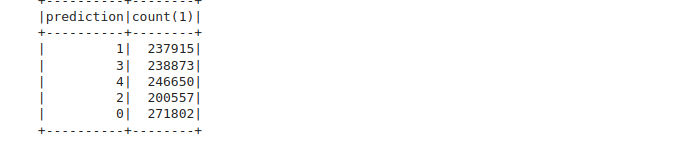

# Segmentation Client avec PySpark et KMeans

Ce projet implémente une segmentation client en utilisant **PySpark** et l'algorithme **KMeans**. La segmentation repose sur la méthode **RFM (Récence, Fréquence, Montant)** pour mieux comprendre le comportement des clients et optimiser les stratégies marketing.

Le fichier **`MSPR_Clustring.ipynb`** contient le code complet du projet avec la partie Nettoyage et exploration des données.

## Méthodologie

1. **Exploration des données** :Analyse statistiques et comprehension des données

2. **Préparation des données** : Extraction et nettoyage des données clients et calcul des scores RFM.

3. **Détermination du nombre optimal de clusters** : Utilisation de la méthode **Elbow** et le **le score de silhouette** pour identifier le nombre optimal de clusters.
4. **Segmentation avec KMeans** : Application de l'algorithme KMeans pour regrouper les clients en segments homogènes.
5. **Analyse des clusters** : Étude de la distribution des clusters et des prédictions obtenues.

## Détermination du Nombre Optimal de Clusters

Un leger coude apparait à k=5

Le score de silhouette le plus haut et atteint à k=5

## Distribution des Clusters

On remarque que les clusters sont équilibrés

## Affectation des Clients aux Clusters

Chaque client est attribué à un cluster spécifique en fonction de ses caractéristiques RFM.

## Prédictions et Interprétation

L'algorithme peut être utilisé pour prédire le segment d'un nouveau client en fonction de ses données RFM.

## Technologies Utilisées

- **PySpark** pour la manipulation des big data
- **KMeans** pour la segmentation
- **Matplotlib/Seaborn** pour la visualisation
